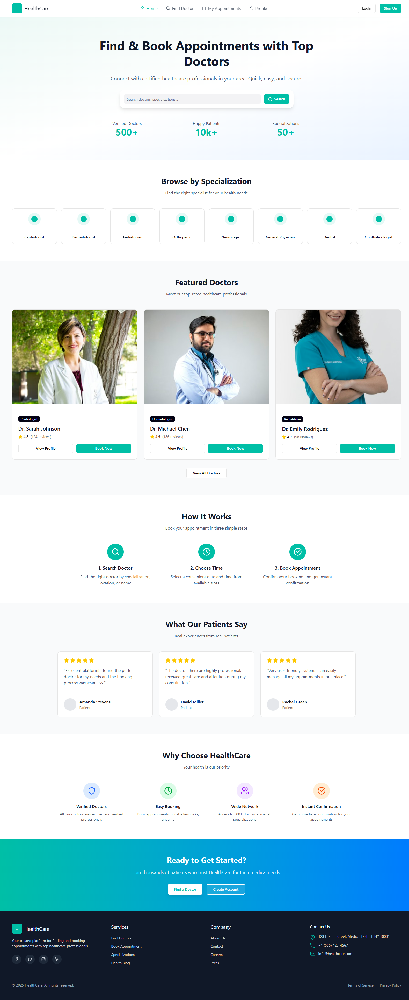
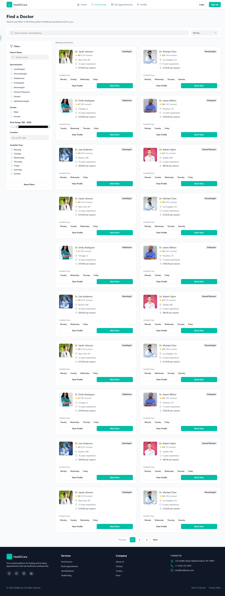
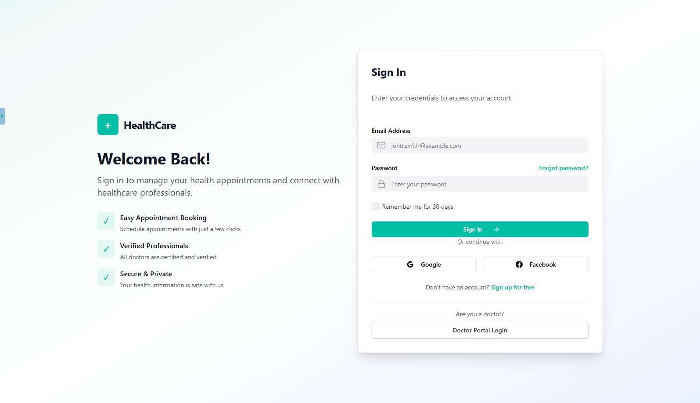
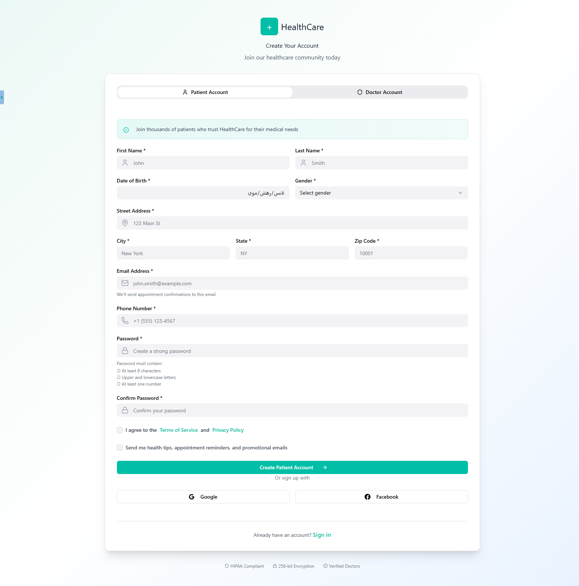
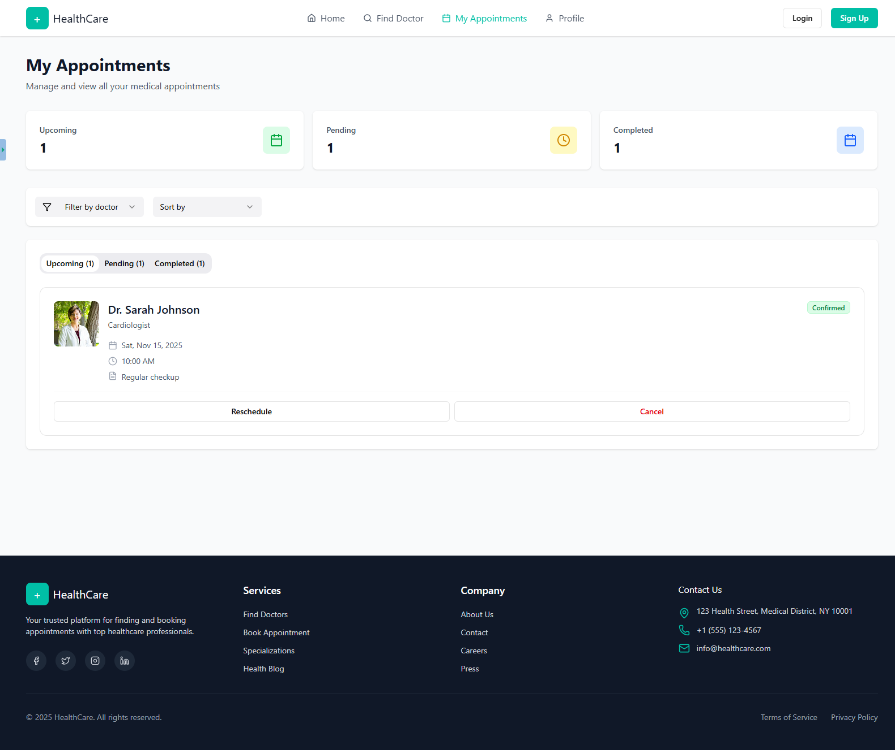
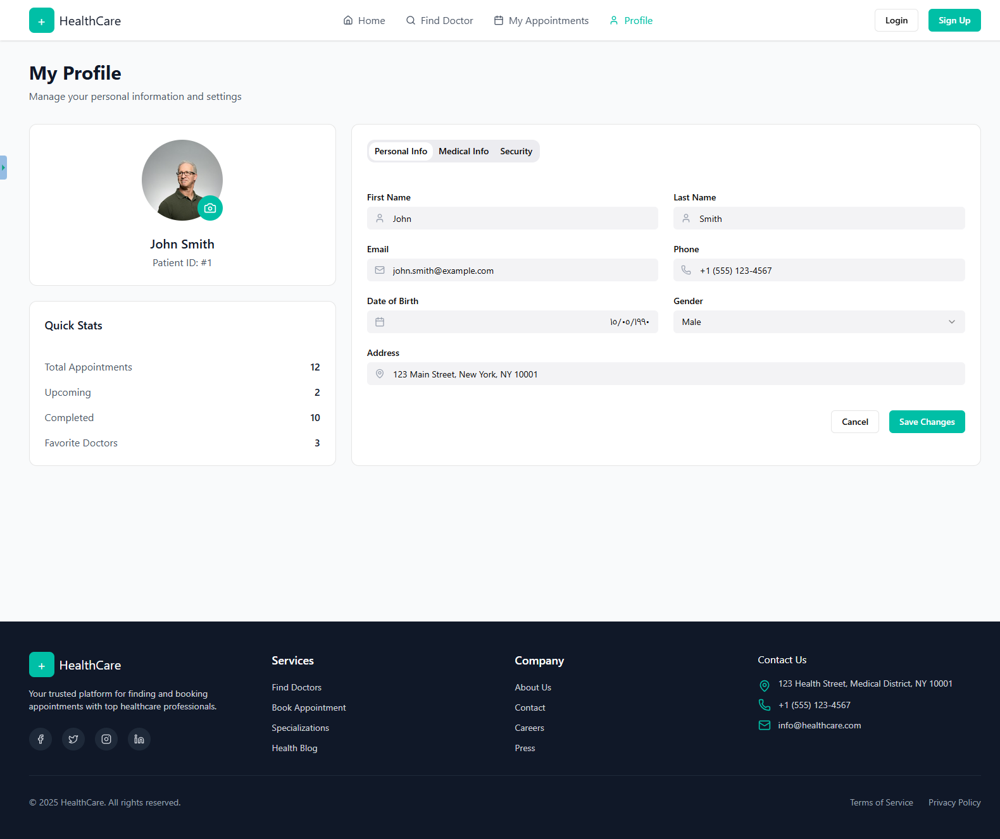
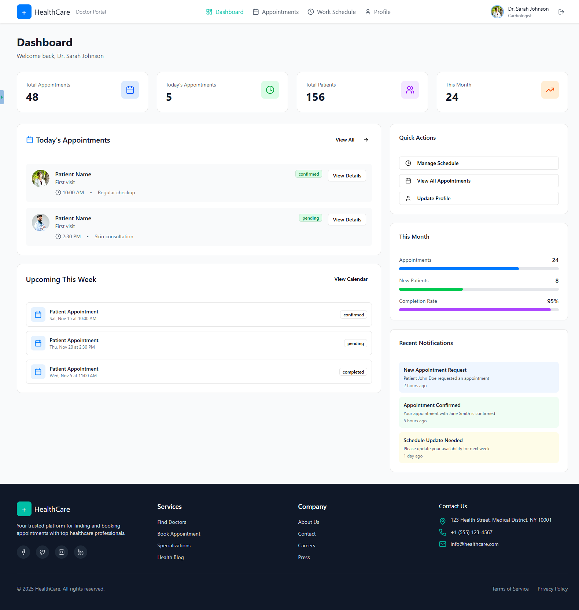
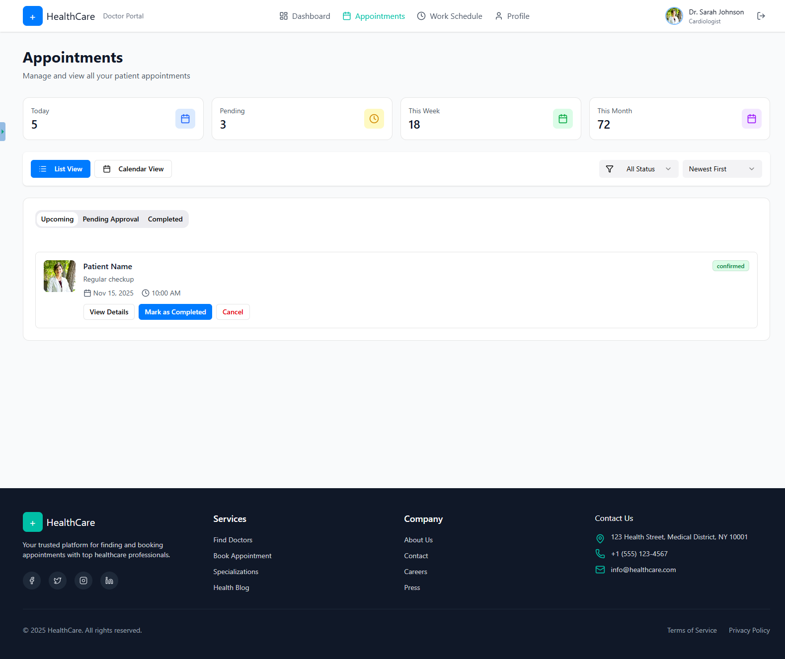
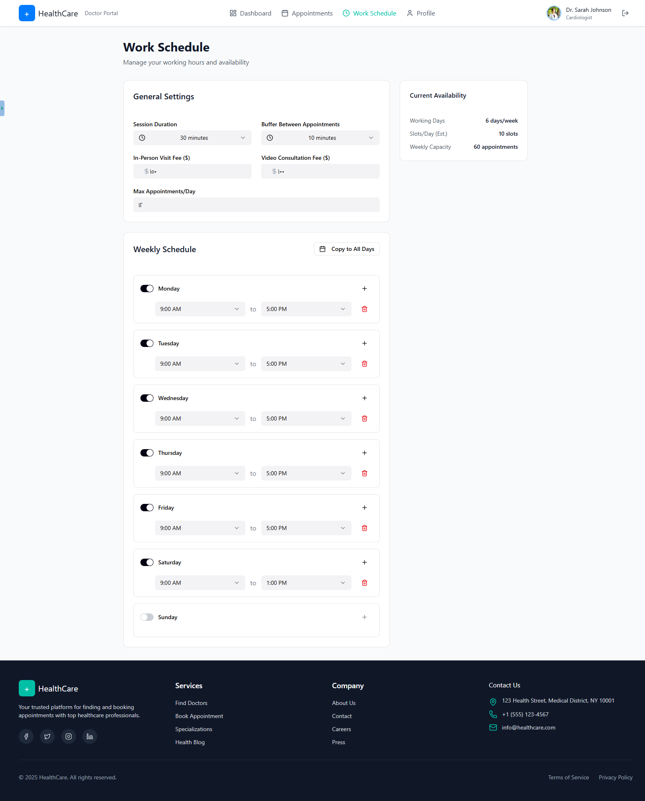
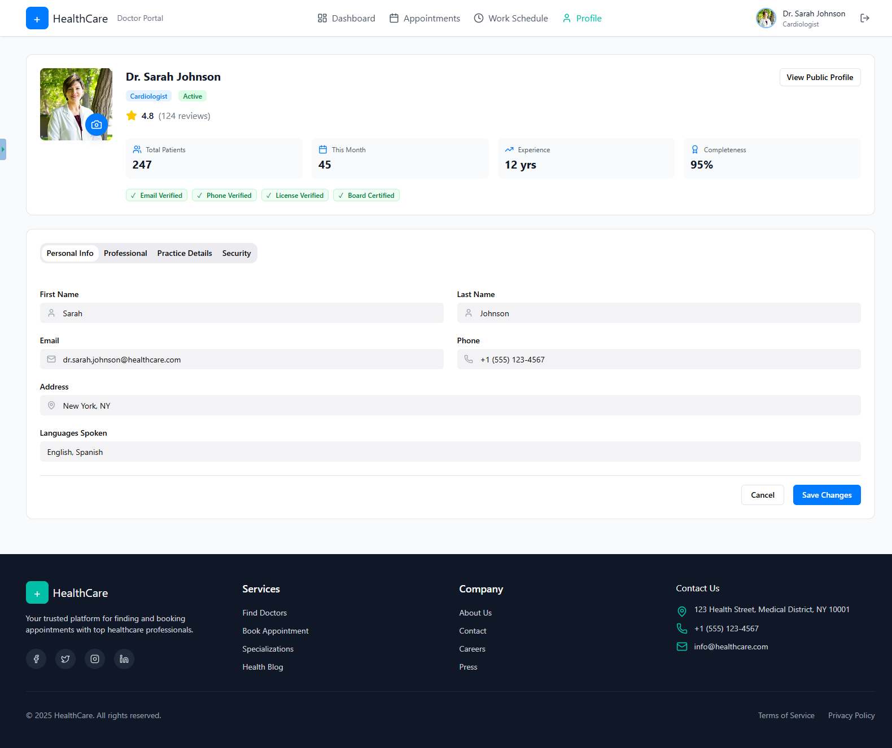

# Doctor Appointment and Scheduling System UI

Angular-based front-end for a medical appointment platform. Patients can browse doctors, book appointments, and manage visits, while doctors can review schedules and appointment details through role-based views.

## Tech Stack

- Angular 20
- TypeScript
- RxJS
- Angular Router
- SCSS
- Tailwind CSS
- Angular CDK

## Key Features

- Public patient flow for finding doctors and viewing profile details
- Appointment booking and rescheduling workflows
- Role-based access for patient and doctor dashboards
- Schedule and appointment management views for providers
- Responsive UI built with reusable Angular components and shared layouts

## How to Run Locally

1. Install dependencies:
   ```bash
   npm install
   ```
2. Start the development server:
   ```bash
   npm start
   ```
3. Open the app in a browser at:
   ```text
   http://localhost:4200/
   ```

Optional:

- Build for production: `npm run build`
- Run unit tests: `npm test`octor
## Screenshots

- Home: 
- Find Doctor: 
- Login: 
- Register: 
- Patient Appointments: 
- Patient Profile: 
- Doctor Dashboard: 
- Doctor Appointments: 
- Doctor Schedule: 
- Doctor Profile: 
